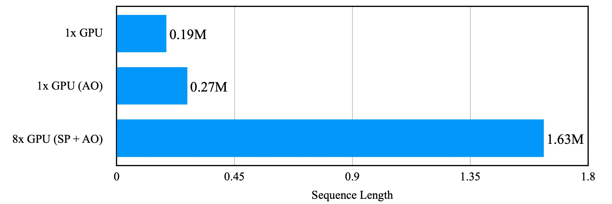

# LiteGen
 A light-weight and high-efficient training framework for accelerating diffusion tasks.

## 📜 About

LiteGen is a lightweight and high efficient training acceleration framework specifically designed for diffusion tasks, and has been applied and validated on video generation project [Vchitech-2.0](https://github.com/Vchitect/Vchitect-2.0). This framework integrates multiple training optimization techniques and offers a user-friendly interface, allowing researchers and developers to easily scale from single-GPU setups to multi-node, multi-GPU environments.

## ✨ Support Features

- vae:
  - DP vae
  - Sliced vae
  - vae.encode compile
- ema model:
  - sharded EMA (Exponential Moving Average)
- text encoder:
  - sharded text encoder
- distributed optimization
  - DDP
  - ZeRO1,2,3
  - Sequence Parallel (Ulysses implementation for Vchitect-2.0 Model)
- memory optimization
  - Grad activation checkpointing
  - selective checkpointing

We also provide easy-to-use interfaces for common operations such as model loading and saving, etc. LiteGen allows users to focus on generative algorithm development and training without getting bogged down in implementation details.

## 🔨 Usage

Implementing LiteGen's optimizations involves two straightforward steps:

1. **Configuration**: Adjust the relevant fields in your config file to enable desired optimizations.
2. **Integration**: Utilize the api from the `LiteGen` instance in your codebase. These simple steps allow you seamlessly integrating optimizations into your existing workflow.

### Quick Start Guide

Follow these steps to integrate LiteGen into your project:

1. **Create LiteGen**

Create a `LiteGen` instance using your configuration file:

``` python
from litegen import LiteGen
gen = LiteGen(config)
```

2. **Initialize Components**

Use the `initialize` function to set up your training environment. This versatile function accepts various components, and returns the optimized version in the same order as the input arguments.

```python
model, optimizer, text_encoder, dataloader, vae_encode = gen.initialize(
    model,          # Your trainable model (only one is accepted)
    optimizer,      # Optimizer for the model
    text_encoder,   # Untrainable models (e.g., encoders in diffusion tasks)
    dataset,        # Your dataset
    vae.encode      # Computing functions (e.g., VAE encoding)
)
```

The two steps described above constitute the minimal code changes required to implement LiteGen's optimizations. This approach allows for quick integration while leveraging LiteGen's performance enhancements.

In the following sections, we provide a detailed explanation of the specific optimizations LiteGen offers and how to configure the corresponding key-value pairs in the config file.

### Optimizations

#### DDP or ZeRO for the Trainable Model

LiteGen offers flexibility in choosing between Distributed Data Parallel (DDP) and different stages of ZeRO (Zero Redundancy Optimizer) for your trainable model. This choice is controlled by the `zero_degree` field in the configuration file:

- `zero_degree = 0 or None`: Uses DDP
- `zero_degree = 1`: Implements ZeRO Stage 1
- `zero_degree = 2`: Implements ZeRO Stage 2
- `zero_degree = 3`: Implements ZeRO Stage 3

When using ZeRO Stage 3, you can enable grouped ZeRO3 by setting `group_zero` to `True`. This option limits communication within a single node, potentially reducing inter-node communication overhead and enhancing training performance.

Example configuration:

```yaml
zero_degree: 3
group_zero: True
```

**Note**: While the `initialize` interface supports optimizing multiple models passed in any order, it only supports one trainable model. The function determines if a model is trainable by checking if any of its parameters have `requires_grad=True`. For all non-trainable models passed to the function, ensure you set `.requires_grad_(False)` beforehand.

#### Selective Activation Checkpointing

LiteGen incorporates activation checkpointing, a common optimization technique for reducing memory usage, and simplifies its usage. Furthermore, when sufficient memory is available, we allow for selective application of activation checkpointing to specific modules, thereby reducing performance overhead.

Example configuration:

```yaml
selective_ratio: 0.2    # Ratio of modules that do NOT use activation checkpointing.
                        # 0: All blocks in the model use activation checkpointing.
                        # 1: No blocks in the model use activation checkpointing.
```

**Note:**

1. Activation checkpointing only applies to the trainable model.
2. Implement `get_fsdp_wrap_module_list()` in your model class to specify modules for checkpointing.
3. If not implemented, LiteGen automatically detects and applies checkpointing to repetitive module structures in the model (e.g., repeated transformer blocks in DiT models).

#### Activation Offload

To further conserve GPU memory, we have implemented CPU offloading for activations in our system. This technique effectively overlaps computation and communication, significantly reducing memory usage during training with minimal additional performance overhead.

You can enable this feature using the following configuration:

```yaml
ac_offload: True
```

**Note:** This feature, like selective activation checkpointing, applies to the trainable model and relies on the `get_fsdp_wrap_module_list()` method or automatic detection of repetitive modules.

#### Sequence Parallel

LiteGen supports the DeepSpeed Ulysses implementation of Sequence Parallel. Through module conversion mechanisms and PyTorch hooks, we enable the transformation from a serial model to a Sequence Parallel model with minimal modifications.

You can configure this feature as follows:

```yaml
sp_size: 8  # Sequence parallel degree
```

**Note:**

Sequence Parallel inherently requires scatter and gather operations on tensors within certain modules. Therefore, LiteGen's implementation necessitates a Sequence Parallel version of the AttentionProcessor for the Attention class, as well as a conversion mapping in the ModuleConverter from serial AttentionProcessor to its Sequence Parallel counterpart.

We have successfully implemented Sequence Parallel support for the Vchitect-2.0 model using LiteGen. For reference, you can find the relevant code in the [Vchitect-2.0](https://github.com/Vchitect/Vchitect-2.0) repository.


#### Sharded Encoder

In addition to optimizing the trainable model, LiteGen also supports parameter sharding for inference-only (untrainable) models, such as text encoders in diffusion tasks. This feature further reduces memory usage across your entire pipeline.

Configure this feature as follows:

```yaml
encoder:
  fsdp: True        # Enable parameter sharding
  group: False      # When True, sharding is limited to within a node, reducing inter-node communication overhead
```

**Note:** The system identifies models for sharded encoder optimization by checking for the absence of parameters with `requires_grad=True`. To utilize this optimization, set `requires_grad_(False)` on the relevant model before calling LiteGen's `initialize()` method.

Here's an example of optimizing both a trainable model and an untrainable model simultaneously:

```python
dit = load_dit_model()
text_encoder = load_text_encoders()
dit.train()
text_encoder.requires_grad_(False)
dit, text_encoder = gen.initialize(dit, text_encoder)
```

#### EMA Model

The Exponential Moving Average (EMA) model is a common technique used to smooth parameter updates and achieve better training results. LiteGen integrates EMA Model functionality with support for parameter sharding to conserve GPU memory, while providing an easy-to-use interface.

Example configuration:

```yaml
ema:
  enable: True   # Enable EMA
  sharded: True  # Use parameter sharding for the EMA model
```

**User Interface:** LiteGen provides a simple method to update the EMA model:

```python
gen.update_ema(model, decay=0.9999)
```

#### Checkpoint saving and loading

LiteGen provides convenient interfaces for saving and loading checkpoints, enabling easy resumption of training without dealing with the intricacies of distributed checkpoints.

**Saving Checkpoints**

We offer three separate interfaces for saving model, optimizer, and EMA model states:

```python
gen.save_model(output_folder=None, filename=None, step=None)
gen.save_optimizer(output_folder=None, filename=None, step=None)
gen.save_ema(output_folder=None, filename=None, step=None)
```

1. Specify `output_folder` and `filename` to determine the checkpoint file location.
2. If `output_folder` is unspecified but `filename` is provided, the system uses the `result_dir` defined in the config.
3. Without a specified `filename`, the system uses the `exp_name` from the config as the checkpoint prefix:
   * Model: `[exp_name].pth`
   * Optimizer: `[exp_name].optim_state.pth`
   * EMA model: `[exp_name].ema.pth`
4. We recommend specifying the current `step` when saving checkpoints. If `step` is provided without a `filename`, the system appends the step information to the `exp_name` prefix: `[exp_name]_step[StepNum]`.

**Loading Checkpoints**

LiteGen supports various checkpoint loading modes, configurable in the config file. Listed in order of increasing priority:

1. `init_from`:

   * Used for loading initial model weights.
   * Suitable for starting a new fine-tuning process (step=0).
   * Loads only the model state dict, not optimizer state or EMA weights.

   Example:

   ```yaml
   init_from: 'path_to_the_init_model/model.pth'
   ```

2. `resume_from`:

   * Used to resume training from a specific checkpoint.
   * Automatically loads corresponding optimizer state.
   * For EMA model resumption, specify the EMA checkpoint path separately.

   Example:

   ```yaml
   resume_from: 'path_to_the_resumed_model/model_10.pth'
   ema:
     enable: True
     resume_from: 'path_to_the_resumed_ema/ema_10.pth'
   ```

   Note: `resume_from` takes precedence over `init_from` if both are specified.

3. `auto_resume`:

   * Automatically finds and resumes from the latest saved checkpoint.
   * Enable by setting `auto_resume: True` in the config.
   * Works best with `save_model()`, `save_optimizer()`, and `save_ema()` calls that only specify the `step`.
   * Searches for the most recent checkpoint (based on step number) in the `result_dir` with the `exp_name` prefix.

   Example:

   ```yaml
   auto_resume: True
   ```

   Note: `auto_resume` has higher priority than `resume_from`. It only activates when `resume_from` is empty or unspecified to avoid confusion.


### Config file


As a lightweight training framework, `LiteGen` does not impose restrictions on the type of configuration files, nor does it provide built-in config file parsing. The only requirement for config files is that, once parsed, they should allow access to the necessary system fields using the `config.key` syntax.

We recommend using YAML format for configuration files and parsing them as follows:

1. Define a YAML file. Example:

```yaml
exp_name: 'video_generation_exp1'
results_dir: 'path_to_the_results_dir'

# Checkpoint loading
init_from: 'path_to_the_init_model/model.pth'
auto_resume: False

# Model optimization
selective_ratio: 0
ac_offload: True
zero_degree: 3
group_zero: True

... # Other arguments
```

2. Parse the config file in Python:

```python
import argparse
import yaml
from easydict import EasyDict

parser = argparse.ArgumentParser()
parser.add_argument('--config', type=str, default='configs/config.yaml', help='config file')
args = parser.parse_args()
with open(args.config) as f:
    cfg = yaml.load(f, Loader=yaml.FullLoader)
config = EasyDict(cfg)
```

3. Initialize the LiteGen instance using the config:

```python
gen = LiteGen(config)
```

Here we outline essential configuration fields for the LiteGen. While default values of part of fields are available, explicit configuration is recommended to prevent errors and ambiguity.

```yaml
# experiment and filepath
exp_name: experiement_name
checkpoint_dir: path_to_load_checkpoint
init_from: filepath to the pretrained model checkpoint
resume_from: filepath to the model checkpoint
auto_resume: whether to auto resume the checkpoint, True or False

# precision
precision: parameter precision, one of ['tf32', 'fp32', 'bf16', 'fp16']
grad_precision: gradient precision to reduce in FSDP, one of ['tf32', 'fp32', 'bf16', 'fp16']
allow_tf32: whether to enable tf32. True or False.

# optimizer
lr: learning rate
weight_decay: weight decay
fused_optimizer: whether to use fused optimizer implementation. True or False.

# ddp strategy
zero_degree: degree of ZeRO, one of [0,1,2,3]
group_zero: whether to do zero communication within the node. True or False

# sequence parallel
sp_size: sequence parallel degree

# module convert
fused_layernorm: whether to use fused layernorm implementation. True or False.

# activation optimization
ac_offload: whether to enable activation offload to reduce GPU memory. True or False.
selective_ratio: ratio NOT use activation checkpoint, a float number ranging in 0~1

# ema
ema:
  enable: whether to enable ema. True or False.
  sharded: whether to use shareded ema to reduce GPU memory. True or False.
  resume_from:  path to resume the ema checkpoint. a filepath str or None.

# encoder
encoder:
  fsdp: whether to use fsdp to optimize the encoder memory usage. True or False.
  group: whether to use fsdp within the node for encoder. True or False.

# training settings
global_seed: global random seed
max_steps: max steps number
num_workers: number of workers of dataloader
pin_memory: whether to enable pin_memory for dataloader
global_batch_size: total samples used across all ranks in one optimizer step.
```

Additionally, users can define custom configuration fields to meet specific requirements for algorithm construction and training script needs.


## 🚀 Performance

LiteGen implements Sequence Parallel and Activation Offload techniques, which effectively reduce memory usage and enable training on long sequences for Diffusion tasks. We conducted tests on NVIDIA A100 GPUs to determine the maximum supported sequence length when training Vchitect-2.0. All other optimizations remained the same. The results are as follows:


(AO: Activation Offload, SP: Sequence Parallel)

Results demonstrate that with all memory optimizations enabled, LiteGen supports training on sequences up to 1.63 million tokens in length using 8x NVIDIA A100 GPUs. This corresponds to approximately 150 seconds of video at 760x460 resolution.

## 🔑 License

This code is licensed under Apache-2.0.
